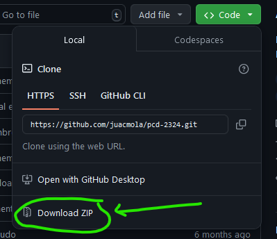

# Exercises of Algorithms and Data Structures

---

##### Disclaimer

The project is intended for educational purpose only.

---

## Contents

- [Exercises of Algorithms and Data Structures](#exercises-of-algorithms-and-data-structures)
        - [Disclaimer](#disclaimer)
  - [Contents](#contents)
  - [Introduction](#introduction)
  - [How to Use the Projects](#how-to-use-the-projects)
  - [Projects \& Exercises](#projects--exercises)
    - [Exercises](#exercises)
    - [Maude](#maude)
    - [Word Corrector](#word-corrector)
    - [Graphs](#graphs)
  - [Credits](#credits)
  - [License](#license)
          - [README.md created with ❤️ by juacmola](#readmemd-created-with-️-by-juacmola)

---

## Introduction

This repository contains the exercises of the course of Algorithms and Data Structure. The course is part of the Degree of Computer Science of the University of Murcia (Universidad de Murcia). This course is being taught in the first semester of the second year of the degree. In this case, our participation in the course was in the academic year 2023/2024. The course was taught by the professor Jesús Sánchez Cuadrado.

It is divided into three projects and some exercises. We attached both the code and the report of each exercise. As you can see, we have used C++ programming language to solve the exercises. The OS is Linux, and we used the terminal to compile and run the programs. The IDE used was Visual Studio Code.

When we wanted to submit our projects and exercises, our professor provided us a website. This website is called Mooshak and is able to correct our programs.

The reports and the code comments are written in Spanish. If you have any questions, please do not hesitate to contact us.

[Back to contents](#contents)

---

## How to Use the Projects

In this case, we have used Visual Studio Code to develop the exercises, but you can use another IDE. The language is Maude and C++. The OS is Linux. The terminal is used to compile and run the programs. For the Maude exercise you do not need the terminal, just open the documents and the report. To run the exercises, you can follow the following steps:

1. Download the repository. Click the 'Code' button and download the ZIP file:
  
2. Unzip the file in the folder you want.
3. Open the terminal in the folder.
4. For `comodines` and `Grafos` exercises, you can compile the program with the command `g++ bishop.cpp -o bishop` and run it with `./bishop` (changing the name of the files in each case).
5. For `wordCorrector` project, follow the instructions that you will find in the [Word Corrector](#word-corrector) section.

[Back to contents](#contents)

---

## Projects & Exercises

In this section, they will appear in order of the submission date.

### [Exercises](./Projects&Exercises/comodines)

You can find the exercises here: [folder](./Projects&Exercises/comodines). The purpose of these exercises was to get some extra points in the course.

- [bishop](./Projects&Exercises/comodines/bishop.cpp) - This exercise is about the bishop piece of chess. The program receives the initial position of the bishop and the final position. The program must determine the number of positions the bishop will make to finish inthe final position.

- [naranjasopistachos](./Projects&Exercises/comodines/naranjasopistachos.cpp) - In this exercise, the player must write down in the terminal the kilometer where he starts and the type of stand (oranges or pistachios). The program must determine which type of stand he will find if he drive the kilometers that the player has written.

- [winterishere](./Projects&Exercises/comodines/winterishere.cpp) - Lastly, players can write down one day of the calendar, and the program will determine if winter has come.

### [Maude](./Projects&Exercises/MAUDE)

In this little project, we learned how to create sentences in the Maude language. So, there are fourteen tests (some were about natural numbers and others about different kinds of group data, as lists, queues, stacks, etc). Each test it is explained in the report. As I said earlier, the reports are written in Spanish, but it is easy to understand the purpose of each test.
The dates of teh report are from 2021 because I did not pass the course at the first attempt, but I did it in 2023/2024.

### [Word Corrector](./Projects&Exercises/wordCorrector)

The Word Corrector project was the longest by far. It is divided in four sections, where the difficulty increase in each one. Overall, we were recontructing a dictionary and correcting words. Mooshak (the webpage with all the statement exercise), gave us the instructions of the project. There were some mandatory parts of the project and also some optional features (it was in our hand to choose which one to implement).
[Section 1](./Projects&Exercises/wordCorrector/Exercises/seccion1/) helped us to  get the basic structure of the project. [Section 2](./Projects&Exercises/wordCorrector/Exercises/seccion2/) implements a hash table and an Anagram feature(this was optional). [Section 3](./Projects&Exercises/wordCorrector/Exercises/seccion3/) implements a trie tree and a 'strech words' feature (also optional). The most important section is the [fourth one](./Projects&Exercises/wordCorrector/Exercises/seccion4/) (it implemets both the hashing and the trie tree).

If you want to try `section 4`, I have attached inside the foulder some input and output files. After you have downloaded the folder (.zip) and unzip it, follow the next steps:

1. Open the terminal in the folder.
2. Write all the commands that appear in the image:

What we are doing here is to compile the program and run it. The program is made by different classes (the name of those classes appear in the image). When we write `make`, the `Makefile` file is compiling all the classes and creating an executable file (`a.out`). After that, we run the program with the command `./a.out` and we add the input (`204b.in`) and the file where the program will write the output (`output`). Finally, we compare the output with the expected output (`204b.out`). As you can see, the output is correct because it has the same result. You can see the result in the file `output`.

### [Graphs](./Projects&Exercises/Grafos)

To learn how to make graph algorithms, I made fout problems. Some of the algorithms were sown in class, but they are reconocibles for many people. In the report are the instructions of how I solved them.

[Back to contents](#contents)

---

## Credits

The project was developed by the following people:

- [juacmola](https://github.com/juacmola)
- [antonio12365](https://github.com/antonio12365)

We counted with the supervision of our professor Jesús Sánchez Cuadrado ([LinkedIn](https://www.linkedin.com/in/jes%C3%BAs-s%C3%A1nchez-cuadrado-57ba355/?originalSubdomain=es)) ([Investigation Web](https://portalinvestigacion.um.es/investigadores/331792/detalle)).

For the submission of the extra exercises, we entered in [Olimpiada Programación](https://onlinejudge.inf.um.es/~mooshak/cgi-bin/execute/4297441176277325?config+language+es).
For the submission of the projects, we entered in [Mooshak](https://mooshak.inf.um.es/~mooshak/cgi-bin/execute/78515964037979?config+language+es).

Lastly, this is part of one of the courses of the Degree of Computer Science of the [Universidad de Murcia](https://www.um.es/web/estudios/grados/informatica) - (Universidad de Murcia).

[Back to contents](#contents)

---

## License

This project has the default copyright license. That means that no one may reproduce, distribute, or create derivative works from our work.

[Back to contents](#contents)

externnal

---

###### README.md created with ❤️ by [juacmola](https://github.com/juacmola)
